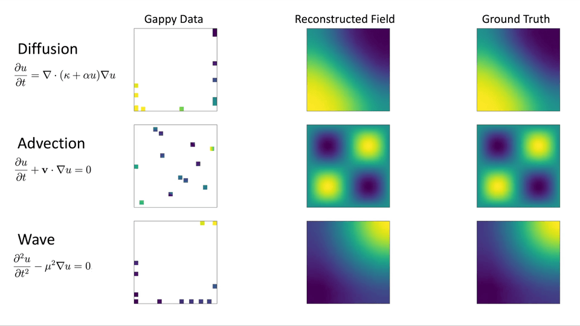
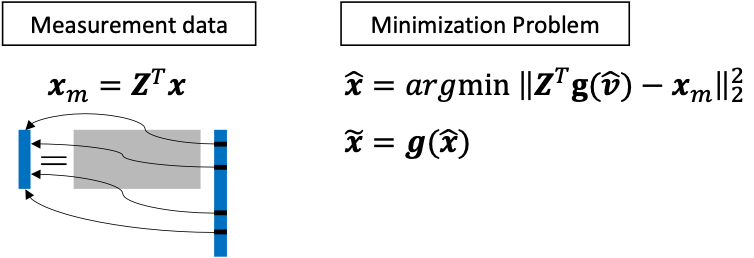

# Gappy AE

This repository contains Jupyter notebooks for numerical examples of the paper titled "[Gappy Data Reconstruction using Unsupervised Learning for Digital Twin](https://arxiv.org/abs/2312.07902)".
Note that an open-source FEM solver, [MFEM](https://mfem.org/) was used to generate training data. Please refer to the paper for more details. Since the size of the training data is large, we do not upload it here. The training data will be provided upon request via email at youngkyu_kim@berkeley.edu.



<!-- # Usage -->
## Requirements

This repository has been tested with Ubuntu Server 22.04, CUDA 12.1, pytorch 2.2.1 environment.

**Installing PyTorch**  
PyTorch must be installed by following the installation guide on the [PyTorch Official Website](https://pytorch.org/). 

**Installing Sparse Linear**  
Sparse Linear modules are designed to efficiently handle operations on sparse matrices. 

Packages required by the project can be installed using the following command:

 ```bash
   pip3 install sparselinear torch-scatter torch-sparse
 ```

## Data Generation
<!---->


**GappyAE**  
To clone this repository, open your terminal and run the following command:
```bash
git clone https://github.com/youngkyu-kim/GappyAE.git
```

**LaSDI**  
Clone the [LaSDI](https://github.com/LLNL/LaSDI) repository and build it with the source codes and makefiles provided. Place the cloned repository into your preferred directory :

1. Navigate to the directory where you want to place the LaSDI project.  
2. Run the following command to clone the repository or Download:

   ```bash
   git clone https://github.com/LLNL/LaSDI.git
   ```
  
Once cloned, navigate into the LaSDI directory and build : `./setup.sh` 

1. Move to your installed directory: 
```bash
cd path/to/your/LaSDI
```

2. Remove the existing directories: 
```bash
rm -r Radial\ Advection Diffusion
```

3. Copy *ex16_diffusion, ex23_wave, and ex9_advection* directories in `1_Data_Generation` to your LaSDI: 
```bash
cp -r path/to/your/GappyAE/1_Data_Generation/*  path/to/your/LaSDI
```

4. Navigate into the *ex16_diffusion, ex23_wave, and ex9_advection* directory and change mode of bash_ex16.sh, bash_ex23.sh, bash_ex9.sh, respectively:
```bash
chmod +x bash_exXX.sh

./bash_exXX.sh
```

5. Move the `data` directory to the `GappyAE/__data` directory as separate directories once the build is complete:
```bash
cp -r ex9_advection/data/* GappyAE-main/__data/ex9_advection/
cp -r ex16_diffusion/data/* GappyAE-main/__data/ex16_diffusion
cp -r ex23_wave/data/* GappyAE-main/__data/ex23_wave
```
Below figures show five snapshots for two extreme parameter values.


*Diffusion simulation solutions from the initial to the final time for param=0.75*


*Diffusion simulation solutions from the initial to the final time for param=1.25*


*Advection simulation solutions from the initial to the final time for param=0.75*


*Advection simulation solutions from the initial to the final time for param=1.25*


*Wave simulation solutions from the initial to the final time for param=0.75*


*Wave simulation solutions from the initial to the final time for param=1.25*

<!-- ## Data Generation


1. Build [LaSDI](https://github.com/LLNL/LaSDI) or [MFEM](https://mfem.org/) with souce codes and makefiles located in "1_Data_Generation" folder.
    - Example 9 (Advection Problem)
    - Example 16 (Diffusion Problem)
    - Example 23 (Wave Problem)
2. Run shell scripts in "1_Data_Generation" folder to generate training data.   -->

<!-- Below figures show five snapshots for two extreme parameter values.


*Diffusion simulation solutions from the initial to the final time for param=0.75*


*Diffusion simulation solutions from the initial to the final time for param=1.25*


*Advection simulation solutions from the initial to the final time for param=0.75*


*Advection simulation solutions from the initial to the final time for param=1.25*


*Wave simulation solutions from the initial to the final time for param=0.75*


*Wave simulation solutions from the initial to the final time for param=1.25* -->

## Model Training 


**AE**  
To find nonlinear manifold denoted as function $g(\hat{x})$, you need to train auto-encoders.

1. Move to 2_Model_Training folder and run `train_NM_XXX.ipynb`
2. Trained models are saved in `__model`

**POD**  
To find POD basis denoted as function $\Phi$, you need to do SVD.

1. Move to 2_Model_Training folder and run `train_LS_XXX.ipynb`
2. Trained models are saved in `__model`

## Data Reconstruction
<!---->


**Gappy AE**
1. Move to `3_Data_Reconstruction` folder and run `gappyAE_[PROBLEM_TYPE]_[MEASUREMENT_REGION]_[SAMPLING_ALGORITHM].ipynb`

- `[PROBLEM_TYPE]`: diffusion/advection/wave
- `[MEASUREMENT_REGION]`: inner/bndry
- `[SAMPLING_ALGORITHM]`: uniform/LHS/DEIM/*SOPT

**Gappy POD**
1. Move to `3_Data_Reconstruction` folder and run `gappyPOD_[PROBLEM_TYPE]_[MEASUREMENT_REGION]_[SAMPLING_ALGORITHM].ipynb`

- `[PROBLEM_TYPE]`: diffusion/advection/wave
- `[MEASUREMENT_REGION]`: inner/bndry
- `[SAMPLING_ALGORITHM]`: uniform/LHS/DEIM/*SOPT

*Note: You need to build [pylibROM](https://github.com/LLNL/pylibROM) and run python scripts in "SOPT_scripts" folder to get SOPT sample points. If you want to skip this step, you can use the SOPT sample points that are provided in "2.5_SOPT/SOPT_sample_points" folder.

**SOPT(optional)**
```bash
build pylibROM in docker container

sudo docker pull ghcr.io/llnl/librom/librom_env:latest

mkdir pylibROM_docker && cd pylibROM_docker

git clone https://github.com/LLNL/libROM.git && git clone --recurse-submodules https://github.com/llnl/pylibROM.git

cp -r path/to/your/GappyAE-main/2.5_SOPT/* pylibROM_docker/pylibROM/tests

sudo docker run -it -v $HOME/pylibROM_docker:/home/test/ ghcr.io/llnl/librom/librom_env:latest

cd pylibROM

sudo apt install python-is-python3

sudo pip install --upgrade pip==23.2.1

sudo pip install ./

cd tests

sudo ./run_SOPT.sh

exit

cd path/to/your/pylibROM_docker

cp -r tests/SOPT_scripts/SOPT_sample_points path/to/your/GappyAE/__model
```


## Paper
```
Kim, Y., Choi, Y., & Yoo, B. (2023). Gappy Data Reconstruction using Unsupervised Learning for Digital Twin. arXiv preprint arXiv:2312.07902.
```

## Citation
```
@article{kim2023gappy,
  title={Gappy Data Reconstruction using Unsupervised Learning for Digital Twin},
  author={Kim, Youngkyu and Choi, Youngsoo and Yoo, Byounghyun},
  journal={arXiv preprint arXiv:2312.07902},
  year={2023}
}
```

## Authors
- Youngkyu Kim (KIST)
- Hyeokmin Lee (KIST)
